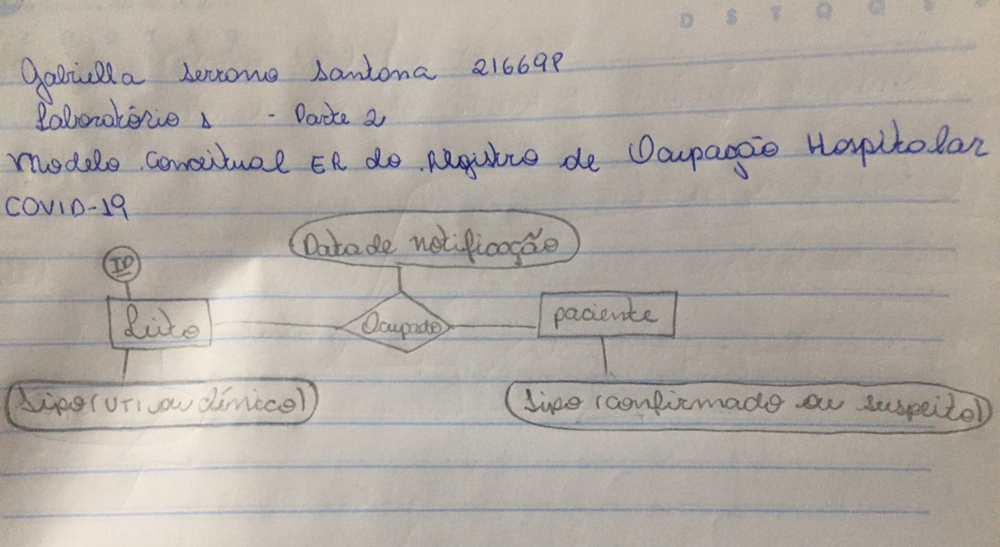

# Aluno 
* 216698 Gabriella Serrano Santana
## Tarefa 1 sobre APIs de acesso
[Notebook](https://colab.research.google.com/drive/1m6pFTRG3D-KvQriJ7m-vVD6ayyLZge-x?usp=sharing)
## Tarefa 2 sobre Engenharia Reversa

