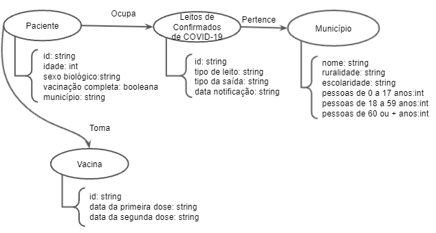

# Lab07 - Modelo Lógico para Banco de Dados de Grafos

# Aluno
* 216698: Gabriella Serrano Santana

## Modelo Lógico do Banco de Dados de Grafos

## Perguntas de Pesquisa/análise

* Municípicios com boa escolaridade possuem maiores índices de vacinação? (Uma boa educação ajuda na conscientização da necessidade de tomar vacinas?)
* Qual é a média de pessoas que são internadas na UTI por COVID-19 e saem vivas? (Qual é a change de uma pessoa internada na UTI por consequência da COVID-19 sair com vida?)
* Qual é a diferença entre a porcentagem de mulheres que tomaram a vacina e homens que tomaram a vacina? (Essa diferença é muito grande? Existe a necessiade de uma campanha de conscientização de vacinação mais direcionada por gênero?)   
