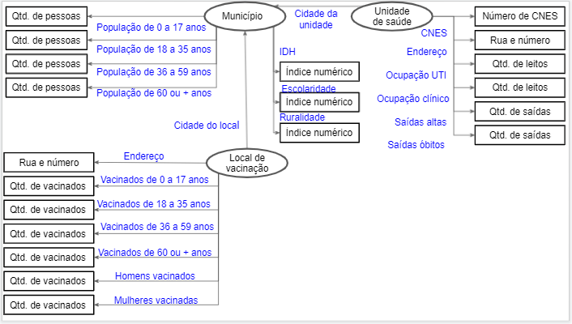

# Lab09 - Grafo de Conhecimento

# Aluno
* 216698: Gabriella Serrano Santana

## Exemplo de Grafo de Conhecimento - para publicar ou enriquecer

## Perguntas de Pesquisa ou Queries
> Liste aqui as três perguntas de pesquisa ou queries
> * Pergunta 1
> * Pergunta 2
> * Pergunta 3
